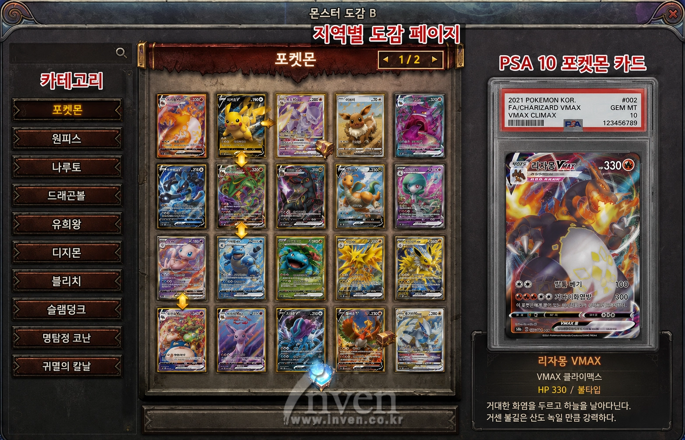
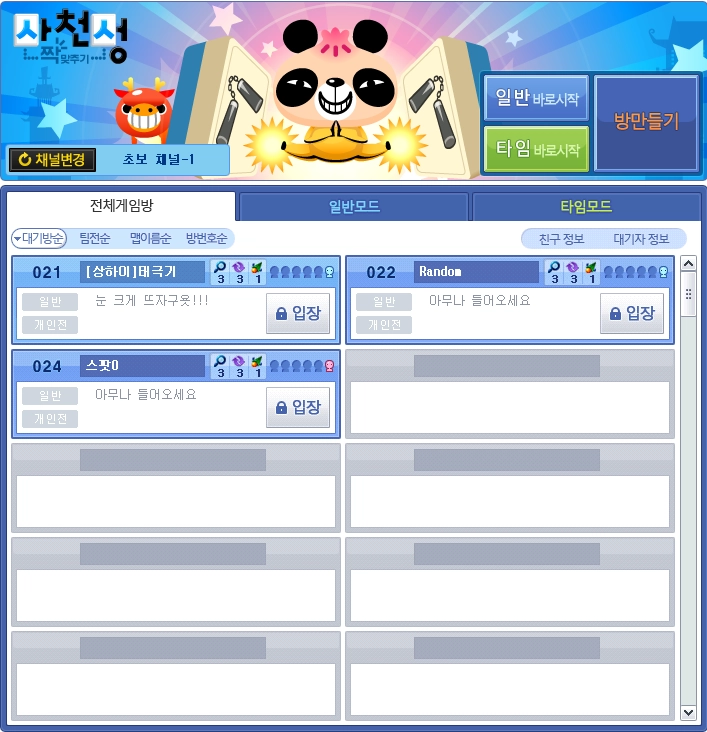
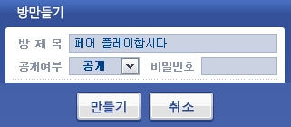
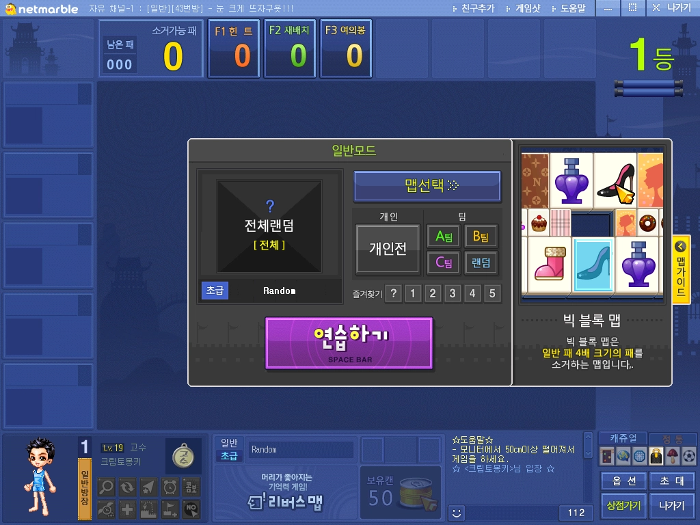
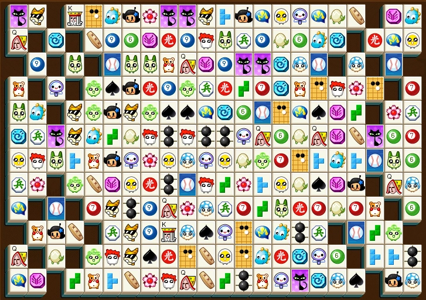
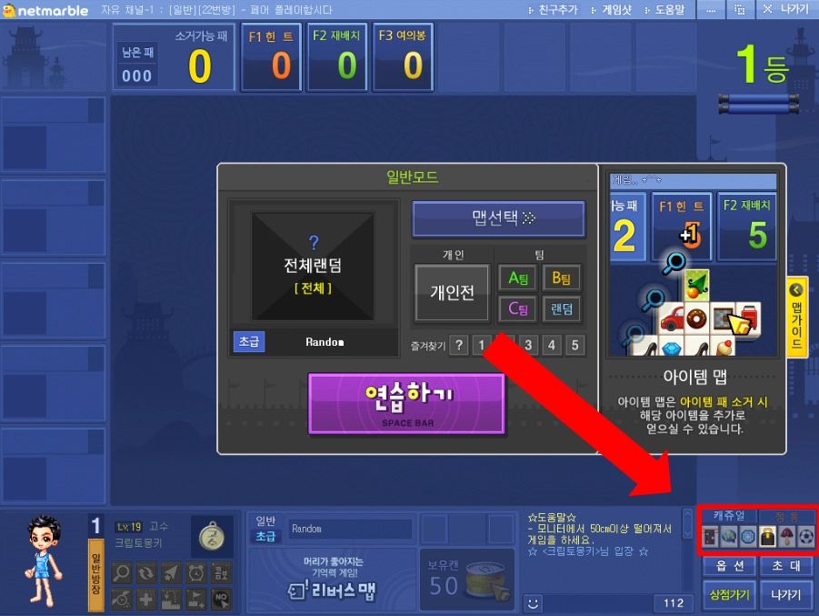
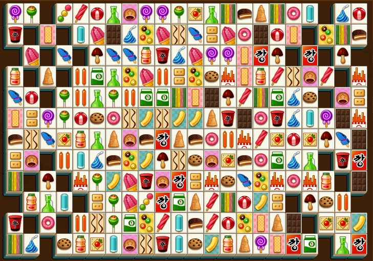
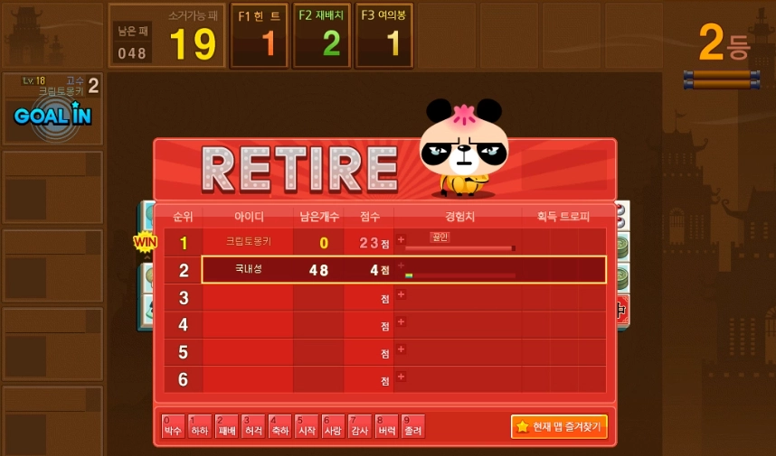
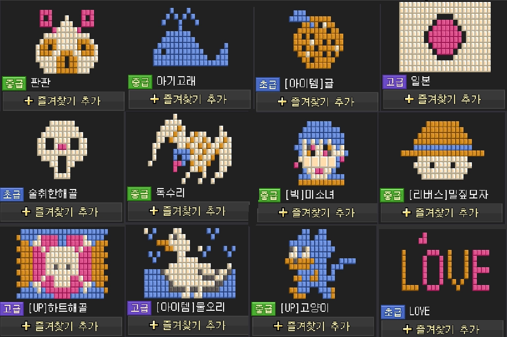

# Renaiss Slab Link

> **한 줄 소개**
> 카드를 짝 지어 없애는 퍼즐을 즐기는 동안, 자연스럽게 Renaiss 카드의 가치와 구조를 배우고, 곧 바로 진짜 카드 마켓으로 이어지는 입문용 게임입니다.

---

## 이게 어떤 게임인가요

Renaiss Slab Link는 화면에 깔린 카드 타일 중에서 **같은 카드 두 장을 찾아 선을 이어 없애는 퍼즐 게임**입니다. 흔히 아는 사천성 게임 방식이라 누구나 설명 없이 바로 시작할 수 있습니다.

다만 여기 등장하는 카드는 평범한 그림이 아니라 Renaiss에 등록되어있는 포켓몬, 원피스 카드입니다. 게임 중 지운 카드들은 인게임 '도감'에 등록됩니다. 한 판이 끝났을 때 도감 달성도를 보여주며 Renaiss 마켓에서 나머지 카드를 구경하도록 유도합니다.

그래서 이 게임을 한 판 하고 나면, 플레이어는 자기도 모르게 "Renaiss에서 카드를 수집한다는 게 어떤 것인지"를 이해하게 됩니다. **재미로 시작해서, 배우게 되고, 실제 마켓으로 넘어가는** 흐름이 핵심입니다.

---

## 왜 이런 게임이 필요한가요

Renaiss는 실제 PSA 등급을 받은 수집 카드를 온라인에서 사고팔 수 있게 만든 플랫폼입니다. 매력적인 서비스이지만, 처음 들어온 사람에게는 진입 장벽이 있습니다.

1. 카드 등급, 시세, 소유권 같은 개념이 처음 보는 사람에게는 낯섭니다.
2. 같은 카드인데 등급에 따라 값이 크게 달라지는 이유가 직관적으로 와닿지 않습니다.
3. 글로 길게 설명하면 어렵게 느껴지고, 끝까지 읽지 않습니다.
4. 가볍게 체험해 보고 자연스럽게 마켓으로 넘어갈 수 있는 입구가 부족합니다.

Renaiss Slab Link는 이 모든 걸 **게임 한 판으로 대신** 합니다. 설명서를 읽는 대신, 직접 플레이하면서 익히게 만드는 것이 목표입니다.

---

## 무엇이 다른가요

1. 실제 Renaiss 카드를 게임의 재료이자 배움의 대상으로 씁니다.
2. 단순 짝 맞추기보다 한 단계 머리를 쓰는 연결 퍼즐입니다.
3. 도감을 통해 수집 지식을 차근차근 알려줍니다.
4. 배움이 곧장 실제 마켓 구매로 이어집니다.
5. 게임 안에서 참여 보상(SBT) 까지 받게 해 다시 찾게 만듭니다.

---

## Renaiss에 어떤 도움이 되나요

1. **신규 유저 확보**: 가볍게 즐기다 들어온 사람을 마켓으로 데려옵니다.
2. **교육 비용 절감**: 어려운 개념을 게임이 대신 설명해 줍니다.
3. **재방문 유도**: 참여 보상을 통해 다시 돌아오게 합니다.
4. **측정 가능한 성과**: "게임을 한 사람 중 몇 퍼센트가 마켓으로 넘어갔는가"를 숫자로 보여줄 수 있습니다.

이 게임의 가치는 단순한 재미가 아니라, **Renaiss의 신규 유저와 마켓 전환에 실제로 기여한다**는 점에 있습니다.

---

## 경기 방식이 어떻게되나요?

1. **개인전이며** 최대 4명까지 참여가능합니다.
2. 방장이 맵을 선택할 수 있고, 모든 플레이어의 별도 “준비” 없이 방장이 “게임시작” 가능합니다.
3. 플레이어 중 가장 먼저 모든 짝을 찾아내는 사람이 1위가 됩니다. 나머지는 남은 패로 점수를 매겨 순위를 지정합니다.
4. 1위가 선정되면 게임 종료까지 10초의 클리어 시간이 주어집니다.

## 어떻게 플레이하나요

1. Renaiss랑 연동된 계정으로 로그인합니다. (X, Web3 지갑)
2. 방을 만들거나 방에 입장합니다.
3. 게임을 시작하면 카드들이 화면 가득 깔립니다.
4. 같은 카드 두 장을 찾습니다.
5. 두 카드를 잇는 선이 **너무 많이 꺾이지 않게 연결되면** 두 장이 사라집니다.
6. 카드가 사라질 때, 그 카드에 대한 짧은 정보가 함께 나타납니다.
7. 화면의 카드를 모두 없애면 한 판이 끝납니다.
8. 더 이상 맞출 카드가 없으면 자동으로 카드가 다시 섞이거나 힌트가 나옵니다.

한 판은 보통 **1~3분** 정도로 짧아서, 부담 없이 여러 번 반복하게 됩니다.

## **맵 콘텐츠 종류는 어떤게 있나요? (클릭)**

1. **일반**
2. **롤링:** 일정시간마다 카드가 우측으로 이동하여 카드를 지우는 각도가 달라진다.
3. **UP:** 맨 아랫줄부터 카드가 한줄씩 올라오며, 해당 층에 지울 카드가 없어지면 카드가 한 층 더 올라온다.
4. **승리 :** “승리” 라고 적힌 카드의 짝은 먼저 연결시킨 사람이 승리하는 게임
5. **상하이 :** 카드가 겹층으로 구성된 사천성 게임

## **콤보를 달성하면 점수가 높아집니다 (클릭)**

1. 5회차 마다 콤보 발생합니다.
2. 5회차엔 원하는 카드 하나의 짝을 삭제할 수 있습니다.
3. 10회차엔 클릭한 카드와 동일한 카드 전부 삭제합니다.

## **게임 중 아이템을 사용할 수 있습니다.**

1. 서치: 현재 지울 수 있는 하나의 짝을 화면에서 반짝이며 강조해 줍니다.
2. 카드 섞기: 연결할 수 있는 짝이 보이지 않을 때, 모든 카드를 섞어서 새로운 루트를 찾을 수 있게 합니다.
3. 망치: 연결 경로와 상관없이, 무조건 화면의 하나의 짝을 지정해서 강제로 파괴

---

## 플레이하면서 무엇을 배우나요 (도감)

이 게임의 진짜 핵심은 “도감 시스템”입니다. 게임 중 카드를 “10회” 제거하면 인게임 “도감”에 등록됩니다.

게임이 끝나면 "오늘 만난 카드"를 한 눈에 정리해 보여주며, 카드들의 도감 달성률을 보여주며, 어떤 카드를 만났는지 가장 값진 카드가 무엇인지 복습할 수 있습니다.

여기서 중요한 점은, 도감이 알려주는 건 카드 캐릭터의 이야기가 아니라 **수집가가 알아야 할 실용 지식**이라는 것입니다.

1. **등급 이야기**: PSA 등급이 무엇인지, 왜 10등급이 9등급보다 비싼지
2. **가치 이야기**: 같은 카드인데 등급에 따라 값이 갈리는 이유
3. **소유 이야기**: 온라인에서 산 카드를 "내 것"으로 갖는다는 의미, 그리고 원하면 실제 실물 카드로 받을 수 있다는 점
4. **컬렉션 이야기**: 이 세트와 시리즈가 왜 의미 있는지

**도감 인터페이스**

1. 카테고리 : 포켓몬 / 원피스 (AI 이미지 레퍼런스 참조)
2. PSA 10 카드가 우측에 표시되며, 하단에는 카드에 대한 간단한 스토리 또는 가격 정보 표기
3. 자세히 보기를 누르면 Renaiss 마켓으로 연결시키며, 웹사이트에서 카드를 확인할 수 있게 유도합니다.
4. 도감을 완성할 시 특별 SBT 보상이 지급됩니다.(포켓몬 / 원피스)

퍼즐의 재미는 빠르게 연속으로 없애는 손맛에 있습니다. 그래서 매번 긴 설명창을 띄우지 않고, 도감을 통해 **읽고 싶은 사람만 더 읽도록** 나눴습니다.

> 게임에 들어온다 → 퍼즐에 빠진다 → 도슨트로 카드 가치를 배운다 → 마켓에서 진짜 카드를 본다 → 참여 보상(배지)을 받고 다시 돌아온다

이렇게 하면 **빨리 게임을 하고싶은 사람도, 게임을 통해 카드를 배우고 싶은 사람도** 둘 다 만족합니다.

---

## 화면 구성

### 대기화면

방 만들기(인원, 비밀번호, 공개여부)를 통해 새로운 방을 개설합니다. 방을 만들시 실제 유저들이 참여하여 같이 즐길 수 있습니다.

### 시작 화면

게임 제목, 맵 선택, 난이도 선택, 시작 버튼이 있습니다. "실제 Renaiss 카드로 즐기는 입문 게임"이라는 소개를 함께 보여줍니다.

### 게임 화면

카드 타일이 깔린 맵, 점수, 남은 카드 수, 타이머, 서치 버튼, 섞기, 망치버튼이 있습니다. 카드를 맞추면 잇는 선 효과와 함께 한 줄 카드가 파괴됩니다.

### **카드 디자인 변경 시스템 구현**

**-** 원피스, 포켓몬 카드 중 직접 선택하여 게임을 즐길 수 있도록 구현합니다.

### 마무리 요약 화면

클리어 여부, 점수, 걸린 시간, 획득한 경험치, 오늘 만난 카드 목록, 등급 분포, 가장 값진 카드, 그리고 마켓 구경과 보상 받기 버튼이 있습니다.

**게임 플레이 매커니즘 요약**

> 게임 시작 → 게임 종료 → 스코어 공개(리더보드) → 도감 달성률 → 게임 시작 (반복)

---

## 맵 모양에 대하여

맵는 매번 똑같은 네모가 아니라, **매 판 다른 모양**으로 선택하여 플레이할 수 있습니다. 단순한 네모보다 보는 재미가 있고, 또 하고 싶게 만듭니다.

**맵 디자인 예시**

1. Renaiss 다운 요소(Renaiss, Vinchi World. Gatcha etc)
2. 콜렉터블 다운 요소(PSA, 카드팩)
3. 포켓몬(인기 많은 포켓몬, 몬스터볼)
4. 원피스(루피, 나미, 쵸파, 밀짚모자, 해적깃발, 악마의 열매)
5. 위 요소를 단순화한 형태로 구성합니다.

---

## 안전과 저작권

1. 해당 게임을 통해 수익을 창출하지 않습니다. (과금 요소 X)
2. 영리목적으로 만든 게임이 아닌 다른 유명 카드의 캐릭터 그림이나 이름, 로고를 사용한 팬게임입니다.
3. 아직 실제 데이터가 아닌 예시 데이터를 쓸 때는 화면에 분명히 표시합니다.
4. 시세나 등급 같은 구체적인 숫자는 반드시 실제 자료에서 가져오며, 임의로 지어내지 않습니다.

---

## 해커톤에서 만들 범위(요긴 일단 손대지말기)

이번 해커톤에서는 **직접 플레이 가능한 웹 데모**를 만듭니다.

꼭 만드는 것:

- 카드 연결 퍼즐과 짝 맞추기
- 매 판 다른 맵 모양
- 등급까지 맞춰야 하는 보통 난이도 규칙
- 예시 카드 데이터(등급, 시세 포함)
- 점수와 마무리 요약 화면
- 막혔을 때 자동 섞기
- 도슨트 3단계(한 줄 미리보기, 자세히 보기, 판 종료 요약)
- 마켓으로 가는 버튼

여유가 되면 추가로 만드는 것:

- 지갑 연결과 실제 카드 데이터 연동
- 실제 참여 보상 배지 연동
- 순위표, 일일 챌린지
- 플레이 기록 저장

---

## 마무리 한 줄

Renaiss Slab Link는 **TCG-RWA를 설명하지 않고, 즐기면서 배우고 마켓으로 넘어가게 만드는** 입문 게임입니다.

---

### 부록: 처음 보는 용어 정리

| 용어           | 쉬운 설명                                                         |
| -------------- | ----------------------------------------------------------------- |
| TCG            | 수집하고 거래하는 카드 게임. 포켓몬 카드 같은 것                  |
| RWA            | 실제 존재하는 물건을 온라인 자산으로 만든 것                      |
| PSA 등급       | 카드 상태를 전문가가 매긴 점수. 보통 8~10등급, 높을수록 가치가 큼 |
| 슬랩           | 등급 받은 카드를 보호하는 투명 케이스. 등급 라벨이 붙어 있음      |
| 시세 (FMV)     | 그 카드가 지금 시장에서 거래되는 대략적인 값                      |
| 실물 교환      | 온라인으로 산 카드를 원하면 진짜 실물 카드로 받는 것              |
| 참여 보상 배지 | 활동하면 받는, 사고팔 수 없는 기록용 배지                         |
